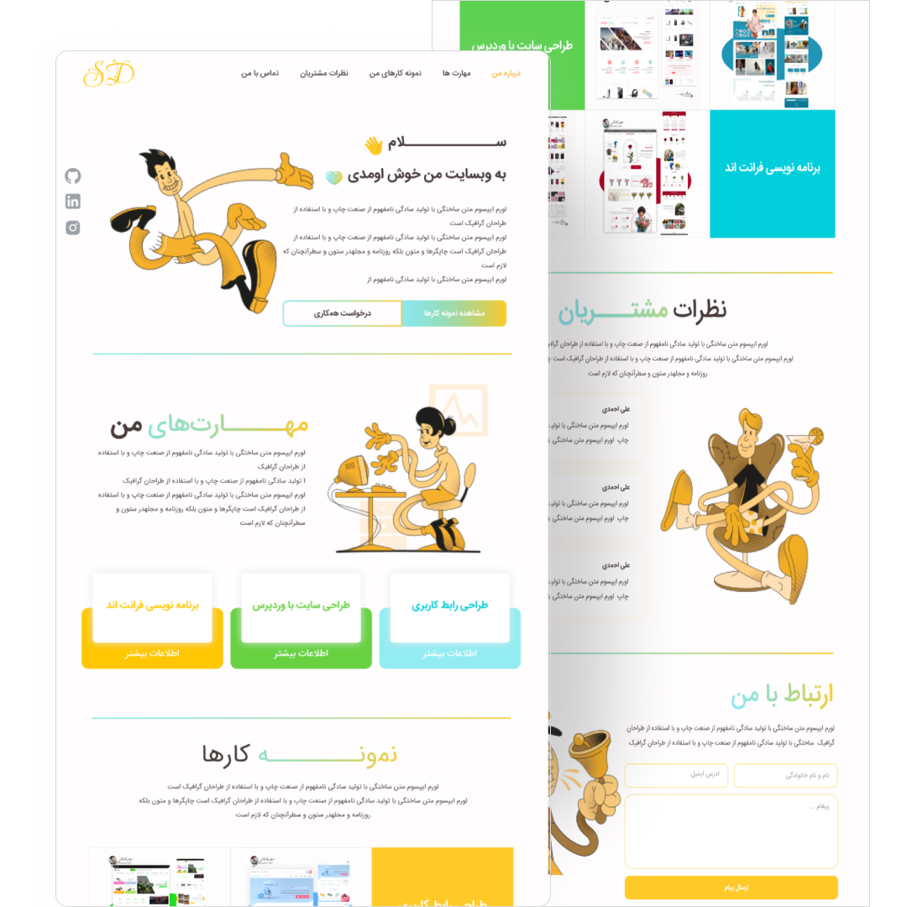

## Free persian portfolio template with reactJS 


This is a free rtl portfolio website template that built with react js and Tailwind CSS .


## Screenshots




## Run Locally

Clone the project

```bash
  git clone https://github.com/shrdaraee/Free-persian-portfolio-template-with-reactJS.git
```

Go to the project directory

```bash
  cd my-project
```

Install dependencies

```bash
  npm install
```

Start the server

```bash
  npm run start
```


## 🚀 About Me
I'm a front end developer and web designer 


[@shrdaraee](https://www.github.com/shrdaraee)


## 🔗 My Social Media
[](https://www.linkedin.com/in/sahar-daraee-bb2a62219/)
[](instagram.com/sahardaraee_ )
